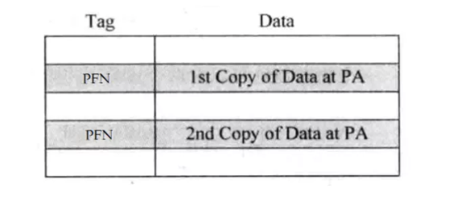

# TLB与Cache在计算机结构中的集成

TLB和Cache都是高速缓存，但它们所存储的内容不同。TLB用于存储虚拟地址到物理地址的转换，而Cache用于存储最近访问过的数据。两者之间可以串行或并行访问。而不同的集成方式也会带来不同的问题，这里主要介绍在包含TLB下的cache组织方式。

## PIPT(Physically-Indexed，Physically-Tagged)
PIPT使用物理地址作为索引和标签。因此**不会产生cache别名**问题，但由于从虚拟地址到物理地址需要等待TLB/MMU的转换，因此我们需要等待TLB/MMU进行虚实地址转换后才能进行cache line寻找操作。

这意味着此时TLB和cache的访问是**串行**的。也会造成更长的延时。

PIPT下的TLB Cache集成方式如下：

 

## VIPT(Virtual-Indexed, Physically-Tagged)
VIPT是指使用虚拟地址做索引，物理地址做标记的cache组织方式。这种方式的优点是在进程切换时，不需要对cache进行清空或失效的操作，因为匹配过程中需要借助物理地址。但是这种方式**存在cache别名**和**cache重名**的问题。

在这种方式下，我们可以对TLB和Cache进行**并行访问**。

VIPT下的TLB Cache集成方式如下：

 

## VIVT(Virtual-Indexed, Virtual-Tagged)
VIVT是指使用虚拟地址做索引，虚拟地址做标记的cache组织方式。这种方式的优点是访问速度快，不需要访问TLB去转换物理地址。但是缺点是会出现**cache别名**和**cache重名**的问题。

在这种方式下，我们可以对TLB和Cache进行**并行访问**。

VIPT下的TLB Cache集成方式如下

 

### Cache别名问题

上面多次提到Cache别名问题，这里介绍一下Cache别名。

Cache别名指的是不同的虚拟地址映射到同一个物理地址，但这些虚拟地址的index不同，导致同一个物理地址的数据被加载到不同的cacheline中。

#### 产生原因

在VIPT和VIVT下，由于我们使用虚拟地址作为index，有可能出现多个虚拟地址映射同一物理地址的情况，例如多个进程共享同一数据内存时，不同进程的虚拟地址可能会映射到同一物理地址段。同时Cache的index位数应该大于虚拟地址中的物理地址位数。

> 解释：当Cache的index位数小于等于虚拟地址的物理地址位数时，我们此时实际上在利用物理地址进行寻址，也就是说此时Cache实际上是PIPT。例如4KB的页表，低12位其实是物理地址，因此当此时Cache的index位数不大于12位时实际上在使用物理地址进行索引，不会出现别名问题。示意图如下。

示意图如下

 

#### 造成结果

由于别名的存在，当我们对虚拟地址内的数据进行修改时，如果有多个cacheline映射了同一个物理数据，我们只会修改了其中一个，造成了缓存不一致问题。

#### 解决方案

### Cache重名问题

另一个问题是Cache重名问题，这里我们也进行介绍。

Cache重名问题指的是相同的虚拟地址会映射到不同的物理地址，直接使用Cache中缓存的数据可能造成错误。

#### 产生原因

由于多个进程地址空间相对独立，因此不同进程的同一个虚拟地址会映射在不同的物理地址上。但我们使用cache中缓存的内容进行使用则可能会出现内存访问错误的问题（B进程访问了A进程的数据）

#### 造成结果

单个进程的执行没有任何影响，但出现上下文切换后可能在B进程的访问会在Cache中定位到A进程缓存的数据，造成了错误。

#### 解决方案
